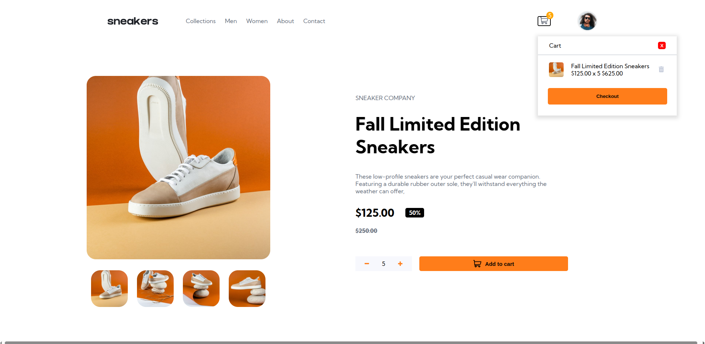
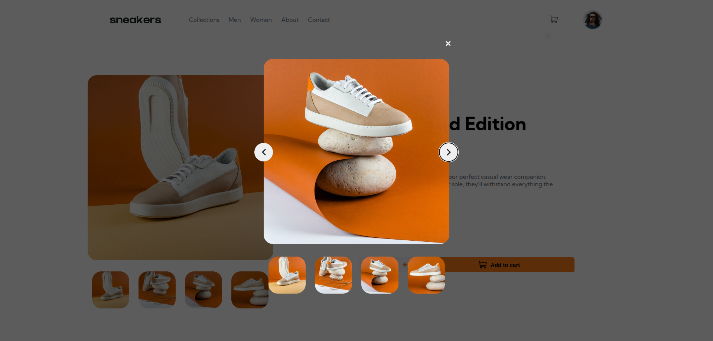

# Frontend Mentor - E-commerce product page solution

This is a solution to the [E-commerce product page challenge on Frontend Mentor](https://www.frontendmentor.io/challenges/ecommerce-product-page-UPsZ9MJp6). Frontend Mentor challenges help you improve your coding skills by building realistic projects.

## Table of contents

- [Overview](#overview)
  - [The challenge](#the-challenge)
  - [Screenshot](#screenshot)
  - [Links](#links)
- [My process](#my-process)
  - [Built with](#built-with)
  - [What I learned](#what-i-learned)
  - [Continued development](#continued-development)
  - [Useful resources](#useful-resources)

## Overview

### The challenge

Users should be able to:

- See hover states for all interactive elements on the page
- Open a lightbox gallery by clicking on the large product image
- Switch the large product image by clicking on the small thumbnail images
- Add items to the cart
- View the cart and remove items from it

### Screenshot




### Links

- Live Site URL: [Preview](https://azanra.github.io/ecommerce-product/)

## My process

### Built with

- Javacript class and modules
- Bundled with webpack

### What I learned

Practicing on using a webpack to bundle it. this time i use different webpack configuration depending on which build. eg for prod it will use mode production
which webpack will optimize the size of the bundle to as small as possible. while in development mode it will use dev tool to enable live reload. the last one
is the one that config that will be used in both build. The reason to splitting it is to not have to write the same config on each build with the help of webpack-merge
by calling the webpack merge we can merge the our template config and the new config.

```js
const { merge } = require("webpack-merge");
const { common } = require("./webpack.common");
module.exports = merge(common, {
  //New Config
});
```

and to run the dev server or build through npm script with npm run {command}

```js
"scripts": {
    "start": "webpack serve --open --config webpack.dev.js",
    "build": "webpack --config webpack.prod.js",
}
```

To deploy it to github pages, i try to automate it with npm script in package.json. automating the

- Creating new branch
- Merging the new branch with main and bundle the project with prod config
- Add dist file and push it to the new branch

```js
"scripts": {
    "branch": "git branch gh-pages",
    "postbranch": "git checkout gh-pages && git merge main --no-edit && npm run build",
    "deploy": "git add dist -f && git commit",
    "postdeploy": "git subtree push --prefix dist origin gh-pages",
}
```

or you could run all of them in single command

```js
"scripts": {
    "gh-pages": "npm run branch && npm run deploy && git checkout main"
}
```

to help automating the task, it use life cycle script it will run either
before (pre{command}) or after (post{command}). and to run script in order using &&. it will run the next command if the previous command is not error

### Continued development

There is still issue in bundled output. when switching the large image by clicking the thumbnail image will use the thumbnail image on large image.
this is because webpack hash the image filename. and the current logic use the filename to switch between thumbnail image and large image

```js
const largeProductImage = document.querySelector(largeImageElement);
const thumbnailImage = document.querySelectorAll(thumbnailImageElement);
const thumbnailImage = item.children[0].src;
const imgUrl = thumbnailImage.replace("-thumbnail", "");
largeProductImage.children[0].src = imgUrl;
```

### Useful resources

- [Odin Restaurant Assignment](https://www.theodinproject.com/lessons/node-path-javascript-restaurant-page) - Using the instruction to deploy the bundled project to the gh pages
- [Upgrad json script](https://www.upgrad.com/blog/introduction-to-package-json-scripts-in-node-js/) - Explain the life cycle script
- [Webpack merge](https://webpack.js.org/guides/production/) - On splitting the configuration for development or production build
